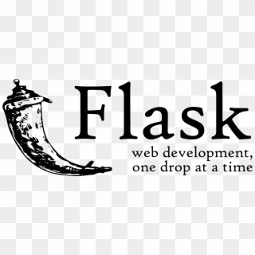

<h1 align="center">Hi there 👋</h1>
<h2 align="center" class="noborder">I am a third year Computer Engineering undergrad from India!</h2>
 

<h3>About Me:</h3>
- 🔭 I’m currently working on - Backend Development  
- 🌱 I’m currently learning DevOps  
- ⚡️ Interests - Backend Development 
- 👯 I’m looking to collaborate on Web Development Projects.  

 

<h3 align="left">Skills: </h3>

 
 
